# Project: Instructions

## Miscellaneous Instructions (opcode=0)

[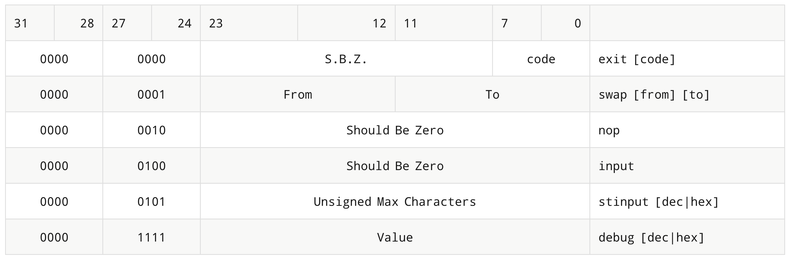](img/Misc_Table.png)

### Exit Instruction

The `exit` instruction has an optional exit code. If the code is omitted, the exit code of 0 will be encoded. Otherwise, the exit code given will be encoded in the exit "code" field. When executed, the exit instruction will terminate the virtual machine. In turn, the virtual machine will exit with the given exit code.

> The opcode/subopcode of 0 was chosen for `exit` since the memory is usually cleared to 0, and this will prevent the machine from outrunning the memory in most cases.

### Swap Instruction

The `swap` instruction will swap the four-byte values at the memory address given by the stack pointer (`sp+from`) and (`sp+to`). In other words, `swap(sp+from, sp+to)`. This instruction does **NOT** check to make sure (`sp+from`) and (`sp+to`) are value. It doesn't matter which one is from and which is to. The from and to fields are both 12 bits and are signed values. If from is not specified, it defaults to 4, and if to is not specified, it defaults to 0.

> The from and to fields may be specified as either decimal (base 10) or hexadecimal (base 16). Hexadecimal will be prefixed by 0x. 

### No Operation Instruction

The `nop` (no operation) instruction will not do anything except advance the program counter.

### Input Instruction

The `input` instruction will input an integer value from the console. When the four-byte integer is received, it will be pushed to the stack. The input will be interpreted as base 10 unless a prefix is supplied. If the 0x or 0X prefix is supplied, the input will be interpreted as base 16. If the 0b or 0B prefix is supplied, the input will be interpreted as base 2.

### String Input Instruction

The `stinput` instruction will read a line as a string from the console (stdin). The maximum number of characters that can be pushed to the stack is given by a 24-bit unsigned size encoded in the instruction. If no number is given, the 24 bits will all be encoded with 1s (i.e., `0x00FF_FFFF`). If more characters are given than the maximum size, they will be **discarded**.

If the maximum size is given, it may be specified in either decimal or hex. Hex must be prefixed with 0x.

All leading and trailing whitespace characters will be removed from the input string (not the final, pushed string). Leading and trailing whitespace does **not** count towards the maximum since it is removed before the string is pushed. If no string is given (e.g, the string is nothing but whitespace or is just enter), then 0 is pushed to the stack.

> The string input instruction pushes a string to the stack just like [String Push Instruction](#string-push-instruction) does.

### Debug Instruction

The `debug` instruction is used to tell the machine to output debugging information. The bits [23:0] may be used for any purposes. Your assembler will take an optional value in base 10 or base 16 (if prefixed with 0x) and encode it into this field. If the value is not specified, the field will be encoded with all zeroes.

#### Testing Machine Debug

> Debugging information will not be used for grading. It is used mainly for you to test your machine. However, in order to do so, your assembler must encode it.

---

## Pop Instructions (opcode=1)

[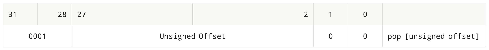](img/Pop_Instructions.png)

### Pop Instruction

The pop instruction will move the stack pointer down by the number given, which is an unsigned value and a multiple of four bytes (`sp = sp + offset`). If the stack pointer is already at the bottom of the memory allocated, this instruction has no effect. If the offset is not given, it is by default 4. If the offset places the stack pointer **past** the end of the memory space, the stack pointer will be reset to the end of the memory space (e.g., `length(memory)`).

---

## Binary Arithmetic Instructions (opcode=2)

[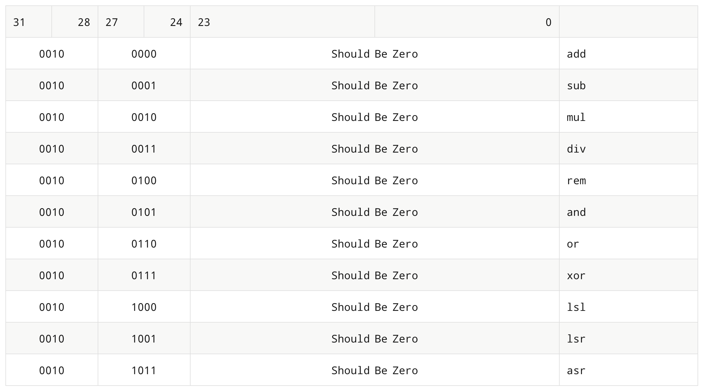](img/Binary_Arithmetic_Instructions.png)

### Binary Arithmetic Instructions

All binary arithmetic instructions will pop the right value first followed by the left value. Then, the arithmetic instruction will be executed on the two values. The result will then be pushed to the stack. All values, input and output, are four-byte integers. These instructions will not error check the stack location prior to popping or pushing values.

`lsl` is a logical left shift for a 32-bit integer. A `lsr` is a logial right shift for a 32-bit integer. An `asr` is an arithmetic right shift for a 32-bit integer.

---

## Unary Arithmetic Instructions (opcode=3)

[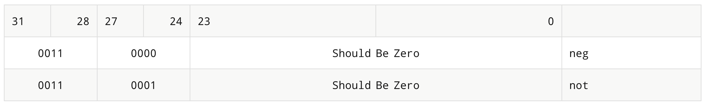](img/Unary_Arithmetic_Instructions.png)

### Unary Arithmetic Instructions

All unary arithmetic instructions will pop the operand from the stack. Then, then after the operation, the result will be pushed onto the stack. All values, input and output, are four-byte integers. These instructions will not error check the stack location prior to popping or pushing values.

---

## String Print Instructions (opcode=4)

[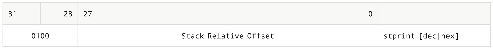](img/String_Print_Instructions.png)

### String Print Instruction

The print instruction will print characters byte-by-byte `*(sp + offset)` until it hits a 0 byte (null terminator) **or** it hits the bottom of the stack. The offset can be given as a decimal or hexadecimal number and is a signed, four-byte integer. If the offset is not given to the instruction, it will be encoded as 0. This instruction will not bounds check the offset.

> Since a full four-byte value can't be pushed to the stack, strings may have a byte of value 1. This byte must be ignored. 

---

## Call Instructions (opcode=5)

[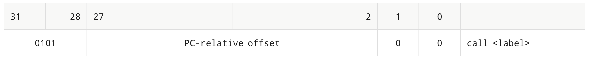](img/Call_Instructions.png)

### Call Instruction

The `call` instruction takes a mandatory label. The assembler will generate a PC-relative offset. An offset of 0 means to call back to the call instruction itself.

The call instruction will first push the program counter of the **next** instruction and then execute a `goto` to the PC-relative offset.

The PC offset must always be a multiple of four, which is why bits 1:0 are 0b00.

---

## Return Instructions (opcode=6)

[](img/Return_Instructions.png)

### Return Instruction

The return instruction pops a 4-byte address off the stack + offset and sets the program counter to that value. The offset is optional. If it is omitted, the offset is set to 0. If the offset is provided, the stack is moved down by that amount. The point of the offset is to "free" an entire stack frame rather than 4 bytes at a time.

The stack offset must always be a multiple of four, which is why bits 1:0 are 0b00.

---

## Unconditional Goto Instructions (opcode=7)

[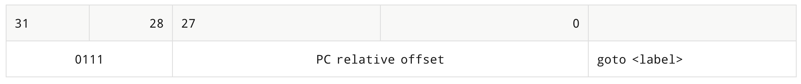](img/Unconditional_Goto_Instructions.png)

### Goto Instruction

The goto instruction takes a label operand. This operand is encoded as a signed value in the instruction itself. When executed, the current value of the PC, which is the `goto` instruction, will be added to the offset, and then the program counter will be moved to that new location to execute the next instruction.

The relative offset will be sign-extended to be four bytes. Since the relative offset is signed, a negative value will move the PC backwards, and a positive value will move the PC forwards.

---

## Binary If Instructions (opcode=8)

[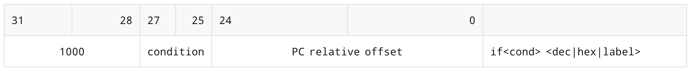](img/Binary_If_Instructions.png)

### Binary If Instructions

The binary if instructions **peek** two values from the stack (left is sp, right is sp+4). If there are not two values on the stack, then any missing value is defaulted to 0. The if statement then compares the operands. If the condition is **false**, then this instruction is a `nop`. If the condition is **true**, then the if statement has the same effect as a `goto` statement in that the program counter of the if instruction is added to the **PC relative offset** encoded in the instruction.

The condition codes for binary if are encoded as follows:

[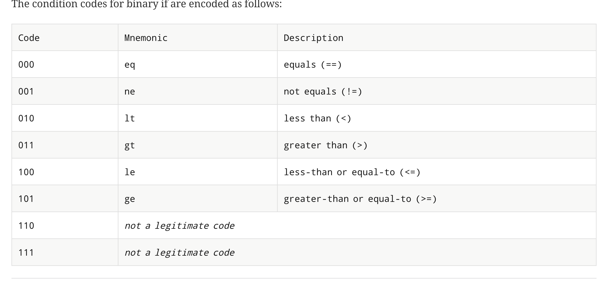](img/Binary_If_Instructions_2.png)

---

## Unary If Instructions (opcode=9)

[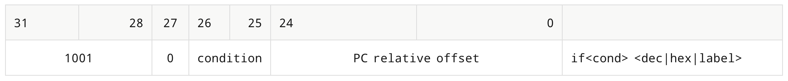](img/Unary_If_Instructions.png)

### Unary If Instructions

The unary if statement will **peek** one value at the stack pointer. There will be no check to make sure a value exists on the stack. If the condition is **false**, then this instruction is a `nop`. Otherwise, if the condition is **true**, then this instruction has the same effect as a `goto` statement. The PC relative offset is **sign-extended** to four bytes and is then added to the program counter of the if statement.

The condition codes for unary if are encoded as follows:

[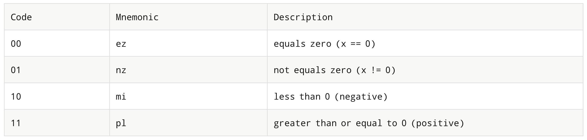](img/Unary_If_Instructions_2.png)

---

## Dup Instructions (opcode=12)

[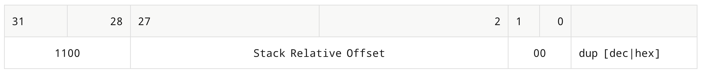](img/Dup_Instructions.png)

### Dup Instruction

The `dup` instruction **peeks** a value from the stack and pushes it. The value peeked is given by `*(sp + sro)`. The `sro` is the stack-relative offset. Since the last two bits are not encoded, the value must be a multiple of four. This is obvious since all values on the stack are four bytes. For example, `dup 0` would duplicate the value at the stack pointer and push it. Whereas, `dup 4` would **peek** the next value from the stack pointer `*(sp + 4)` and push it.

---

## Print Instructions (opcode=13)

[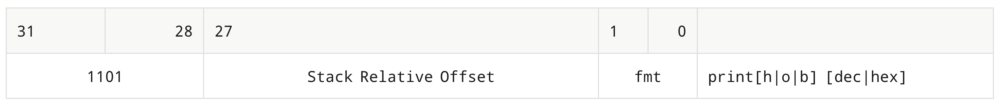](img/Print_Instructions.png)

### Print Instruction

The print instruction will print the four-byte integer value given by the `*(sp + offset)`. The offset can be given as a decimal or hexadecimal number and is a signed, four-byte integer. If the offset is not given to the instruction, it will be encoded as 0. This instruction will not bounds check the offset. After the print instruction prints the integer, it will print a newline character.

The print instruction may end with an h (hex), o (octal), or b (binary), such as `printh`, `printo`, or `printb`. By default, `print` prints in base 10. The format is encoded in the lower two bits (1:0) according to the following.

[](img/Print_Instructions_2.png)

Output

1. Hex will be prefixed with `0x`.
2. Binary will be prefixed with `0b`.
3. Octal will be prefixed with `0o`.
4. Decimal will not be prefixed.
5. No leading zeroes will be printed.

---

## Dump Instructions (opcode=14)

[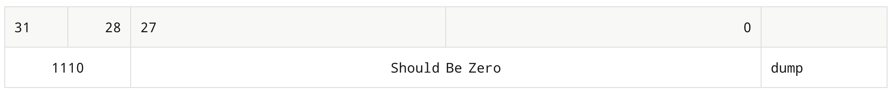](img/Dump_Instructions.png)

### Dump Instruction

The dump instruction will print the address of (relative to the stack) and the value of each value on the stack. If there are no values on the stack, this instruction has the same effect as `nop`. Otherwise, each address will be output using four hex digits, followed by a colon and a space, followed by the value as an eight-digit hex value. No prefixes will be used, and all digits will be lowercase.

---

## Push Instructions (opcode=15)

[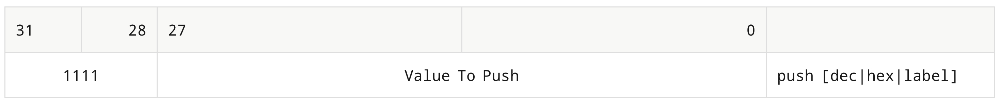](img/Push_Instructions.png)

### Push Instruction

The push instruction will push a four-byte, signed integer onto the stack. The stack pointer will move up (to lower memory address) by four bytes. The value pushed can be in base 10, base 16, or a memory label. If no argument is given to `push`, then the value 0 is pushed to the stack.

### String Push Instruction

The **string push** instruction is a **pseudo-instruction** that will expand into multiple push instructions. The string push instruction will take a string literal and expand to mulitiple push statements to push the string. The string push will ensure that after it is used, the stprint instruction will print the string exactly as given. A newline is NOT automatically added, but the null-terminator IS automatically added.

#### Syntax

```plaintext
stpush "Hello World\n"
```

The pseudo-instruction will be named `stpush`, and the string to push will be inside double quotes `""`. Only three escapes are supported, which are `\\`, `\n`, and `\"`.

#### Considerations

Recall that `stprint` will start printing at the current stack pointer + a signed offset, and then it continues in increasing order towards the bottom of the stack printing characters until it hits the bottom of the stack or the NULL terminator 0x00. This means that the **last** thing you push will be the **first** thing that prints.

Also, the `push` instruction pushes in **little-endian**, meaning the bytes you push will be backwards when printed using `stprint`. Therefore, your instruction must swap them to be in the right order.

#### Continuation / Termination Bytes

One byte of the value 1 (0x01), will "continue" for the `stprint` instruction. This is because four bits of a 32-bit value must be used for the opcode of `push`, and therefore, only three characters can be pushed at a time. The last byte will be 0x01, which will fit in a 28-bit immediate field.

For the final three characters, the last byte will be the null terminator, which is a full byte of 0 (0x00).

> Every three characters will result in one push instruction, with the fourth byte pushed either (1) continue or (0) stop.

#### Expansion Example

```plaintext
stpush "Hello World\n"
```

Becomes

```plaintext
push 0x000a646c  # "ld\n"  (stop)
push 0x01726f57  # "Wor"   (cont)
push 0x01206f6c  # "lo "   (cont)
push 0x016c6548  # "Hel"   (cont)
```
